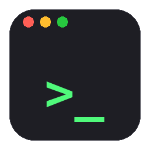
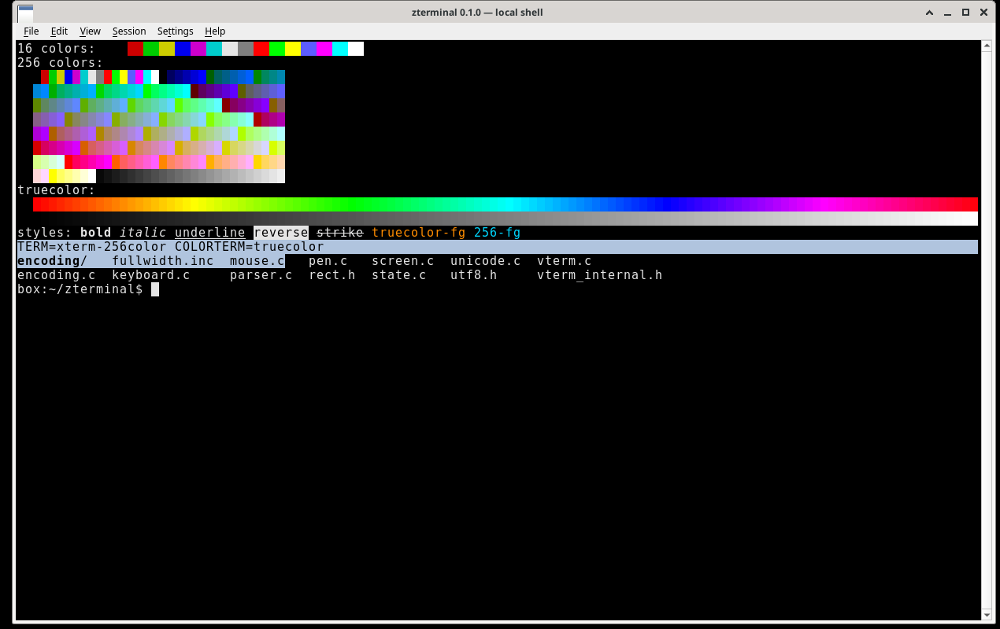

# zterminal



A PuTTY-like terminal emulator for **Linux (amd64)** and **macOS Apple Silicon**,
built with C++20, Qt 6 Widgets, and
[libvterm](https://www.leonerd.org.uk/code/libvterm/).

**1.1.0** — local shell, SSH, and serial sessions with tabs, an encrypted password
vault, session logging, safe paste, Find, keepalive/reconnect, and in-app updates.
See [docs/PLAN.md](docs/PLAN.md) for design notes.



## Features

- **Local / SSH / serial sessions** in tabs. Local shell runs `$SHELL` with
  `TERM=xterm-256color` and `COLORTERM=truecolor`. SSH uses the system `ssh` with a
  validated argv (no shell). Serial uses QSerialPort (9600 8N1 by default).
- **xterm-style emulation** via libvterm: 16 / 256 / truecolor, bold, italic,
  underline, reverse, strike, alternate screen, wide characters, bracketed paste,
  and mouse modes 1000/1002/1003/1006.
- **Colour schemes:** xterm, PuTTY, Solarized Dark, and the brand themes
  **Boilermakers** (Purdue gold on black), **Badgers** (white on UW black, Badger
  Red accents) and **Packers** (white on Packers green, gold accents). Pick one in
  Settings → Preferences, View → Color Scheme, or the session dialog per saved
  session. The brand palette is shared with [zmail](https://github.com/sbj-ee/zmail):
  see [docs/THEMES.md](docs/THEMES.md) and the
  [screenshots](docs/brand-themes.png).
- **Blinking vertical-bar cursor** by default; programs can still change the shape
  and blink via terminal sequences (DECSCUSR / libvterm cursor props).
- **Scrollback:** 100,000 lines per tab by default (or Unlimited in Preferences),
  zlib-compressed; wheel, scroll bar, and Shift+PgUp/PgDn/Home/End.
- **Mouse (PuTTY/X11 style):** left-drag selects (release copies to PRIMARY and
  CLIPBOARD); double-click word / triple-click line; right-click pastes CLIPBOARD;
  Ctrl+right-click opens the menu; middle-click is configurable. Hold **Shift** to
  select or paste when a program has grabbed the mouse.
- **App shortcuts** use Ctrl+Shift+… (Copy Ctrl+Shift+C, Paste Ctrl+Shift+V, …)
  plus F11 and Shift+Insert, so plain Ctrl+C / Ctrl+W and the F-keys still reach
  the program.
- **Saved sessions** (File → New / Open / Save Session): local, SSH, or serial.
  Session INI files never store passwords. **Export / Import Sessions**
  (File menu or the session dialog) writes re-importable JSON
  (`format: zterminal-sessions`); vault passwords are never included — only a
  `passwordStored` flag for SSH.
- **Password vault:** optional, Argon2id + XChaCha20-Poly1305 (libsodium) in
  `~/.config/zterminal/vault.bin`. Per SSH session, “Use stored password” answers
  ssh’s first password prompt via `SSH_ASKPASS`; per serial session,
  Session → Send Stored Login. See [Password vault](#password-vault).
- **Session logging:** Session → Start/Stop Logging (Ctrl+Shift+G) or automatic
  per saved session; red **● REC** while logging. See [Session logs](#session-logs).
- **Safe paste:** multi-line pastes ask first (line count, preview, “don’t ask
  again for this session”). Copies are plain text with trailing whitespace trimmed.
- **Find** (Ctrl+Shift+F): search the current tab’s scrollback + screen; case,
  regex, wrap; all matches highlighted with a count.
- **Keepalive / reconnect:** SSH keepalives (30 s × 3 by default, per session).
  On drop (ssh error or unplugged serial), the tab shows a Reconnect banner and
  keeps scrollback; optional auto-reconnect with backoff. A clean `exit` never
  reconnects.
- **Updates:** Help → Check for Updates, plus a quiet startup check at most once
  a day. On a newer GitHub Release: Install / Later / Skip.
  - **Linux:** downloads `zterminal_<ver>_amd64.deb` + `SHA256SUMS`, refuses on
    checksum mismatch, runs `pkexec apt install`, offers restart.
  - **macOS:** downloads `zterminal-<ver>-Darwin.dmg` + `SHA256SUMS`, verifies,
    opens the disk image for a drag-to-Applications install (no automated replace).
- **Zorro-Z app icon** (terminal window + Z) on Linux hicolor icons and in the
  macOS `.app` bundle (`zterminal.icns`).

## Platforms

| | Linux | macOS |
|---|---|---|
| Package | `zterminal_<ver>_amd64.deb` | `zterminal-<ver>-Darwin.dmg` (Apple Silicon / arm64, macOS 14+) |
| Signing | distro packages | ad-hoc signed `.app` — first launch: right-click → **Open** (or System Settings → Privacy & Security → Open Anyway) |
| Notes | needs `dialout` for serial | Local Network permission prompt; local shell starts in `$HOME` as a **login** shell (Homebrew on PATH); Ctrl-C works |

## Install

Download the assets for [the latest release](https://github.com/sbj-ee/zterminal/releases/latest)
(`zterminal_1.1.0_amd64.deb` or `zterminal-1.1.0-Darwin.dmg`, plus `SHA256SUMS`).

```sh
# Verify the package (Linux or macOS)
sha256sum -c SHA256SUMS          # Linux
shasum -a 256 -c SHA256SUMS      # macOS
```

**Linux:**

```sh
sudo apt install ./zterminal_1.1.0_amd64.deb
# Serial consoles: sudo usermod -aG dialout $USER   # then log out and back in
```

**macOS:** open the `.dmg`, drag **zterminal** to Applications. On first launch,
right-click → Open. Allow Local Network access when prompted if you use SSH / LAN
tools from a local shell.

## Usage

```sh
zt                      # local shell (Linux: detaches from your prompt)
zt core-sw1             # open a saved session (quote names with spaces)
zt --list-sessions
zt ssh user@host        # ad-hoc SSH (all ssh args pass through)
zt serial /dev/ttyUSB0  # ad-hoc serial at 9600 8N1 (or: zt serial /dev/ttyACM0 115200)
zt -e htop
zt --version
```

On macOS the GUI app is `zterminal.app`; the same flags work when launching the
binary inside the bundle. Saved sessions live in `~/.config/zterminal/sessions/`
(one INI per session; owner-only permissions). An SSH example:

```ini
[session]
name=core-sw1
type=ssh

[ssh]
host=10.0.0.1
user=admin
port=22
keyFile=~/.ssh/id_lab
jumpHost=sbj@vertex
extraArgs=-o ServerAliveInterval=30
```

Host, user and jump host are validated (no leading `-`, no spaces or shell
characters); the host always follows `--` on the ssh argv. `authFromVault=true`
is the only password-related flag ever written to the session file.

## Password vault

Prefer SSH keys with `ssh-agent`; the vault is for devices where you must use a
password. Creating the vault asks for a master password twice. **There is no
recovery: if you forget the master password, the stored passwords are lost.**

- **SSH:** tick **Use stored password** in the session dialog; the password goes
  to the vault, never the session file. ssh calls `zterminal-askpass`
  (`SSH_ASKPASS_REQUIRE=force`) over a private one-shot Unix socket.
- **Serial:** set Login user / password, then Session → Send Stored Login.
- **One unlock per process:** tabs and windows opened from inside zterminal share
  the unlocked vault. Lock with Ctrl+Shift+L (or idle auto-lock, default 15 min).

The vault protects passwords **at rest**. It does not protect against malware
running as your user, root, or keyloggers while the vault is unlocked.

## Session logs

Session → Start Logging (Ctrl+Shift+G), or enable automatic logging in the
session dialog. Files go to `~/zterminal-logs/<session>-<YYYYMMDD-HHMMSS>.log`
(folder and per-line timestamps configurable in Preferences). Logs are plain
text (escape sequences stripped); full-screen programs (vim, less, htop) are
omitted. Logging pauses at password prompts and while vault dialogs are open so
passwords stay out of the log. Only what the terminal displays is logged, never
what you type.

## Copy and paste

Selecting copies (PRIMARY, and CLIPBOARD unless turned off); right-click pastes
CLIPBOARD; Ctrl+Shift+C/V also work. A paste that contains a line break asks
first (**Paste N lines?**); Cancel is the default. Single-line pastes go
straight through. Bracketed paste is honored when the program enabled it.

## Building

Requires CMake 3.21+, a C++20 compiler, Ninja, Qt 6.4+ (Widgets, SerialPort,
Network, Test), and libsodium (pkg-config). libvterm is bundled under
`third_party/libvterm/`.

**Linux (Debian/Ubuntu):**

```sh
sudo apt-get install -y qt6-base-dev qt6-serialport-dev libsodium-dev pkg-config \
  libgl1-mesa-dev cmake ninja-build g++
cmake -B build -G Ninja -DCMAKE_BUILD_TYPE=Release
cmake --build build
./build/app/zterminal
```

**macOS (Apple Silicon, Homebrew):**

```sh
brew install qt cmake ninja libsodium pkg-config
cmake -B build -G Ninja -DCMAKE_BUILD_TYPE=Release \
  -DCMAKE_OSX_ARCHITECTURES=arm64 \
  -DCMAKE_PREFIX_PATH="$(brew --prefix qt)" \
  -DCMAKE_OSX_DEPLOYMENT_TARGET=14.0
cmake --build build
open ./build/app/zterminal.app
```

### Tests

```sh
ctest --test-dir build --output-on-failure      # headless (QT_QPA_PLATFORM=offscreen)
./tests/scripts/colortest.sh                    # run inside zterminal: 16/256/truecolor
```

### Packages

```sh
cd build && cpack -G DEB          # Linux  -> zterminal_<version>_amd64.deb
cd build && cpack -G DragNDrop    # macOS  -> zterminal-<version>-Darwin.dmg
```

Pushing a `vX.Y.Z` tag that matches `project(zterminal VERSION …)` runs
`.github/workflows/release.yml`, which builds and publishes both packages plus
`SHA256SUMS`.

## Version bumps

Bump **only** `project(zterminal VERSION x.y.z)` in `CMakeLists.txt`.
`src/version.hpp.in` is generated into the build tree; the window title, About,
`--version`, Info.plist, and the `.deb` / `.dmg` names all follow from it.

## Layout

- `core/` — PTY, libvterm wrapper and scrollback, selection, settings, vault,
  update logic (no widgets)
- `app/` — Qt Widgets UI (`MainWindow`, `TerminalView`, Preferences, …)
- `tests/` — Qt Test suites plus `colortest.sh`
- `third_party/libvterm/` — bundled, unmodified libvterm 0.3.3 (MIT)
- `askpass/` — `zterminal-askpass` (`SSH_ASKPASS` helper)
- `assets/icons/` — Zorro-Z PNG set (and macOS `.icns` input)
- `packaging/` — `zt` launcher and `.desktop` file
- `cmake/` — packaging, macOS bundle / macdeployqt

## License

MIT, see [LICENSE](LICENSE). The bundled libvterm is MIT, © Paul Evans (see
`third_party/libvterm/LICENSE`).
