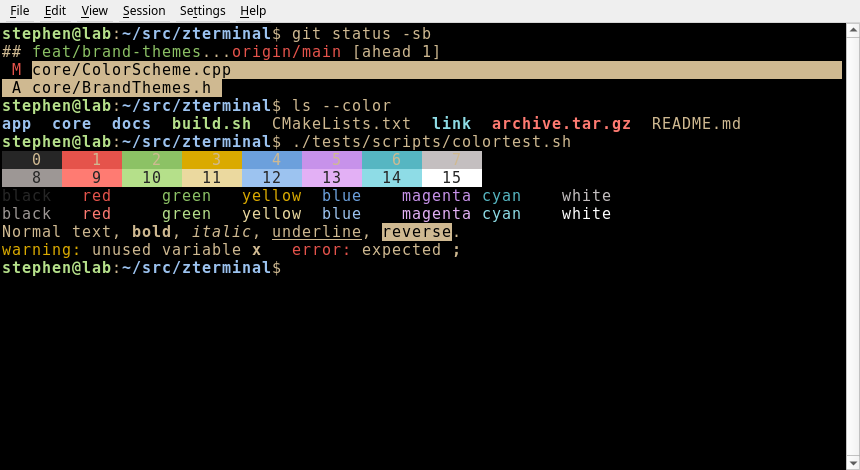
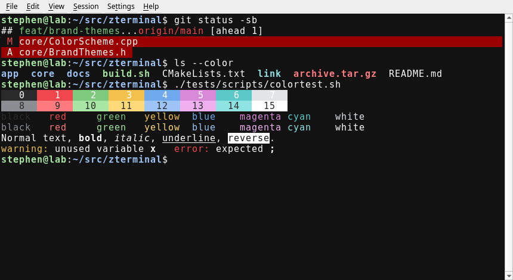
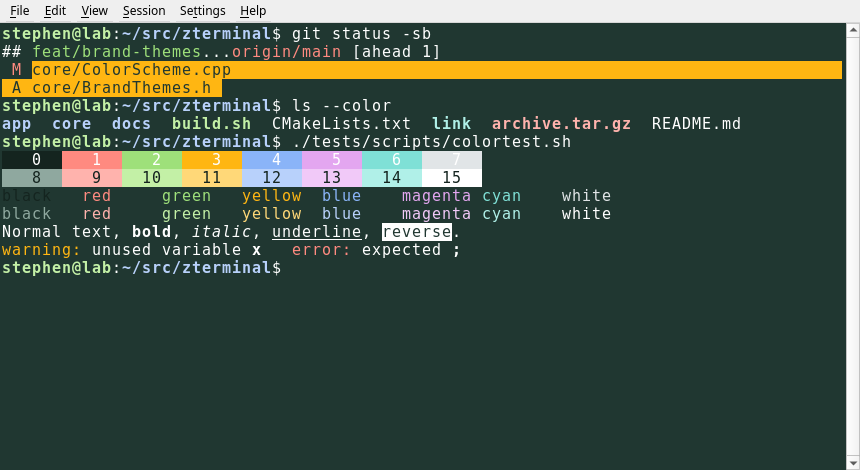
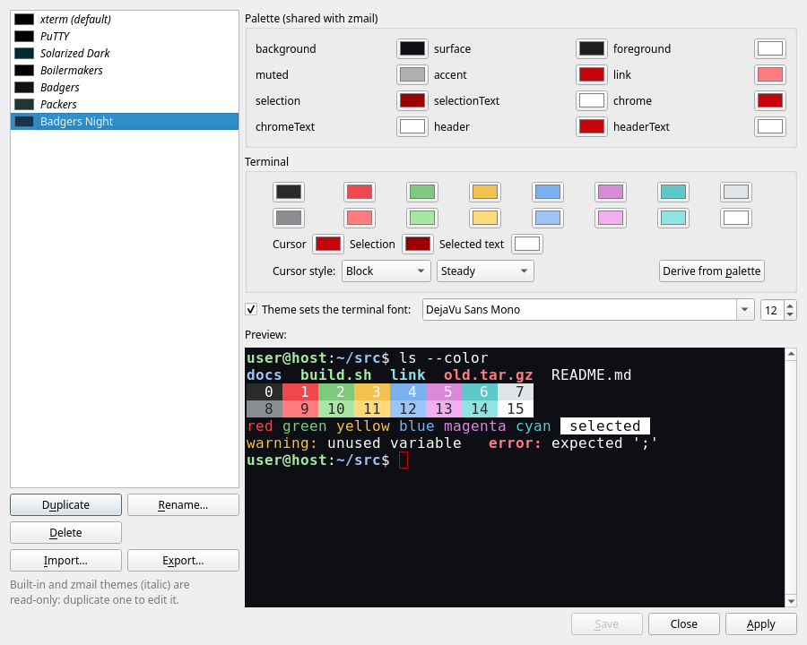
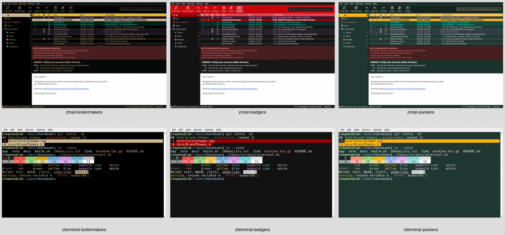

# zterminal


A PuTTY-like terminal emulator for **Linux (amd64)** and **macOS Apple Silicon**,
built with C++20, Qt 6 Widgets, and
[libvterm](https://www.leonerd.org.uk/code/libvterm/).

**1.4.0** — local shell, SSH, and serial sessions with tabs, an encrypted password
vault, session logging, safe paste, Find, keepalive/reconnect, in-app updates,
and a theme editor.
See [docs/PLAN.md](docs/PLAN.md) for design notes.


## Features

- **Local / SSH / serial sessions** in tabs. Local shell runs `$SHELL` with
  `TERM=xterm-256color` and `COLORTERM=truecolor`. SSH uses the system `ssh` with a
  validated argv (no shell). Serial uses QSerialPort (9600 8N1 by default).
- **xterm-style emulation** via libvterm: 16 / 256 / truecolor, bold, italic,
  underline, reverse, strike, alternate screen, wide characters, bracketed paste,
  mouse modes 1000/1002/1003/1006, and focus reporting (1004).
- **Colour schemes:** xterm, PuTTY, Solarized Dark, and the brand themes
  **Boilermakers** (Purdue gold on black), **Badgers** (white on UW black, Badger
  Red accents) and **Packers** (white on Packers green, gold accents). Pick one in
  Settings → Preferences, View → Color Scheme, or the session dialog per saved
  session. The brand palette is shared with [zmail](https://github.com/sbj-ee/zmail):
  see [docs/THEMES.md](docs/THEMES.md) and the
  [screenshots](#themes).
- **Theme editor** (Settings → Theme Editor…, or the bottom of View → Color Scheme):
  duplicate any scheme (brand ones too), edit the palette roles, the 16 ANSI
  colours, cursor/selection colours, cursor style and blink, and optionally the
  terminal font and size, with a live preview. Save, rename, delete, apply,
  import and export. Custom themes are `*.ztheme.json` files in
  `~/.config/zterminal/themes/` (format shared with zmail, see
  [docs/THEMES.md](docs/THEMES.md#theme-files-custom-themes)); zmail's themes in
  `~/.config/zmail/themes/` are listed read-only, with the ANSI colours derived.
- **Blinking vertical-bar cursor** by default; programs can still change the shape
  and blink via terminal sequences (DECSCUSR / libvterm cursor props).
- **Scrollback:** 100,000 lines per tab by default (or Unlimited in Preferences),
  zlib-compressed; wheel, scroll bar, and Shift+PgUp/PgDn/Home/End.
- **Mouse (PuTTY/X11 style):** left-drag selects (release copies to PRIMARY and
  CLIPBOARD); double-click word / triple-click line; right-click pastes CLIPBOARD;
  Ctrl+right-click opens the menu; middle-click is configurable. Hold **Shift** to
  select or paste when a program has grabbed the mouse.
- **App shortcuts** use Ctrl+Shift+… (Copy Ctrl+Shift+C, Paste Ctrl+Shift+V, …)
  plus F11 and Shift+Insert, so plain Ctrl+C / Ctrl+W and the F-keys still reach
  the program. On macOS, ⌘C and ⌘V copy and paste as well.
- **Saved sessions** (File → New / Open / Save Session): local, SSH, or serial.
  Session INI files never store passwords. **Export / Import Sessions**
  (File menu or the session dialog) writes re-importable JSON
  (`format: zterminal-sessions`); vault passwords are never included — only a
  `passwordStored` flag for SSH, which import ignores. See
  [Importing sessions](#importing-sessions).
- **Password vault:** optional, Argon2id + XChaCha20-Poly1305 (libsodium) in
  `~/.config/zterminal/vault.bin`. Per SSH session, “Use stored password” answers
  ssh’s first password prompt via `SSH_ASKPASS`; per serial session,
  Session → Send Stored Login. See [Password vault](#password-vault).
- **Session logging:** Session → Start/Stop Logging (Ctrl+Shift+G) or automatic
  per saved session; red **● REC** while logging. See [Session logs](#session-logs).
- **Safe paste:** multi-line pastes ask first (line count, preview, “don’t ask
  again for this session”). Copies are plain text with trailing whitespace trimmed.
- **Find** (Ctrl+Shift+F): search the current tab’s scrollback + screen; case,
  regex, wrap; all matches highlighted with a count.
- **Keepalive / reconnect:** SSH keepalives (30 s × 3 by default, per session).
  On drop (ssh error or unplugged serial), the tab shows a Reconnect banner and
  keeps scrollback; optional auto-reconnect with backoff. A clean `exit` never
  reconnects.
- **Updates:** Help → Check for Updates, plus a quiet startup check at most once
  a day. On a newer GitHub Release: Install / Later / Skip.
  Nothing is installed unless `SHA256SUMS` carries a valid minisign signature
  (`SHA256SUMS.minisig`) from the release key built into the app, and the
  package matches it.
  - **Linux:** downloads `SHA256SUMS` + `.minisig`, then
    `zterminal_<ver>_amd64.deb`; runs `/usr/bin/pkexec /usr/bin/apt install`
    on a re-verified private copy, offers restart.
  - **macOS:** same checks for `zterminal-<ver>-Darwin.dmg`, then opens the
    disk image for a drag-to-Applications install (no automated replace).
  - **Upgrading from 1.0.x:** 1.0.x only checks SHA-256, so install the first
    signed release by hand once (verify it as below); updates after that are
    signature-checked.
- **Zorro-Z app icon** (terminal window + Z) on Linux hicolor icons and in the
  macOS `.app` bundle (`zterminal.icns`).

## Themes

The Boilermakers, Badgers and Packers colour schemes (offline sample session):

| Boilermakers | Badgers | Packers |
|---|---|---|
|  |  |  |

The Theme Editor (Settings → Theme Editor…) editing a custom theme, with the
palette roles, the 16 ANSI colours, cursor and font settings and a live
preview:



**Shared with zmail.** The themes work the same way in both apps.
Boilermakers, Badgers and Packers are built into zterminal and
[zmail](https://github.com/sbj-ee/zmail) with the same palette, and custom
themes move between them as `*.ztheme.json` files: **Export…** in one app's
Theme Editor writes `<name>.ztheme.json`, and **Import…** in the other app's
editor copies it into that app's themes folder. If both apps run under the
same user, each one also lists the other's custom themes read-only without
importing. A theme made in zmail has no terminal colours, so zterminal derives
the ANSI colours from its palette; zmail keeps but ignores a zterminal theme's
terminal block. The format, the file locations and how missing colours are
filled in are in [docs/THEMES.md](docs/THEMES.md).



## Platforms

| | Linux | macOS |
|---|---|---|
| Package | `zterminal_<ver>_amd64.deb` | `zterminal-<ver>-Darwin.dmg` (Apple Silicon / arm64, macOS 14+) |
| Signing | distro packages | ad-hoc signed `.app` — first launch: right-click → **Open** (or System Settings → Privacy & Security → Open Anyway) |
| Notes | needs `dialout` for serial | Local Network permission prompt; local shell starts in `$HOME` as a **login** shell (Homebrew on PATH); Ctrl-C works |

## Install

Download the assets for [the latest release](https://github.com/sbj-ee/zterminal/releases/latest)
(`zterminal_<ver>_amd64.deb` or `zterminal-<ver>-Darwin.dmg`, plus `SHA256SUMS`
and, from the first signed release on, `SHA256SUMS.minisig`).

```sh
# Verify the signature with the release public key, then the package
minisign -Vm SHA256SUMS -P RWQfb7N3uguWMhJ7jsE/Z0hZ7pDWHQ9OEeWSBTlN/R5bxQ8HWSMxp/l9
sha256sum -c --ignore-missing SHA256SUMS          # Linux
shasum -a 256 -c --ignore-missing SHA256SUMS      # macOS
```

**Linux:**

```sh
sudo apt install ./zterminal_*_amd64.deb
# Serial consoles: sudo usermod -aG dialout $USER   # then log out and back in
```

**macOS:** open the `.dmg`, drag **zterminal** to Applications. On first launch,
right-click → Open. Allow Local Network access when prompted if you use SSH / LAN
tools from a local shell.

## Usage

```sh
zt                      # local shell (Linux: detaches from your prompt)
zt core-sw1             # open a saved session (quote names with spaces)
zt --list-sessions
zt ssh user@host        # ad-hoc SSH (all ssh args pass through)
zt serial /dev/ttyUSB0  # ad-hoc serial at 9600 8N1 (or: zt serial /dev/ttyACM0 115200)
zt -e htop
zt --version
```

On macOS the GUI app is `zterminal.app`; the same flags work when launching the
binary inside the bundle. Saved sessions live in `~/.config/zterminal/sessions/`
(one INI per session; owner-only permissions). An SSH example:

```ini
[session]
name=core-sw1
type=ssh

[ssh]
host=10.0.0.1
user=admin
port=22
keyFile=~/.ssh/id_lab
jumpHost=sbj@vertex
extraArgs=-o ServerAliveInterval=30
```

Host, user and jump host are validated (no leading `-`, no spaces or shell
characters); the host always follows `--` on the ssh argv. `authFromVault=true`
is the only password-related flag ever written to the session file.

## Importing sessions

An import file is treated as untrusted input:

- **Review first.** Every session in the file is listed with its real target,
  jump host, extra ssh options and other non-default settings, and which
  saved sessions it would replace. Nothing is written until you press
  **Import**. Sessions imported without that review (only possible through the
  API) are marked unapproved and won't launch until you open them in the
  session dialog and press **Save**.
- **Refused options.** Sessions whose extra ssh options run local commands,
  load other config files or libraries, defeat host-key checking or forward
  credentials are refused: `ProxyCommand`, `LocalCommand`,
  `PermitLocalCommand`, `KnownHostsCommand`, `Match`, `Include`,
  `PKCS11Provider`, `SecurityKeyProvider`, `RemoteCommand`, `ControlPath`,
  `ControlMaster`, `ControlPersist`, `SendEnv`, `HostName`, `ForwardAgent`,
  `ForwardX11Trusted`, `StrictHostKeyChecking=no/off`,
  `User/GlobalKnownHostsFile=/dev/null`, and `-F -E -I -S -M -A -Y`. Keys
  match case-insensitively in every `-o` spelling (`-oKey=v`, `-o Key=v`,
  `-o "Key v"`, clusters such as `-4oKey=v`). You can still add such options
  by hand to a session you create yourself.
- **No stored passwords.** “Use stored password” is switched off on every
  imported or replaced session.

## Password vault

Prefer SSH keys with `ssh-agent`; the vault is for devices where you must use a
password. Creating the vault asks for a master password twice. **There is no
recovery: if you forget the master password, the stored passwords are lost.**

- **SSH:** tick **Use stored password** in the session dialog; the password goes
  to the vault, never the session file. ssh calls `zterminal-askpass`
  (`SSH_ASKPASS_REQUIRE=force`) over a private one-shot Unix socket.
- **Serial:** set Login user / password, then Session → Send Stored Login.
- **Bound to the target.** Each stored password remembers what it was saved
  for (`user@host:port` as ssh will really use it, including `-l`, `-p`,
  `-o User/Port/HostName` in the extra options; or the serial device). If the
  session now points somewhere else (edited, or replaced by an import), the
  password is not sent: zterminal asks, and only **Use It for …** re-binds it.
  Passwords stored by 1.0.x are bound to their session's current target at
  the first unlock after upgrading.
- **Clean-up.** Deleting a session forgets its stored password; if the vault is
  locked, the deletion is queued (`vault.bin.pending-deletions`, names only)
  and done at the next unlock, which also removes passwords whose session no
  longer exists.
- **One unlock per process:** tabs and windows opened from inside zterminal share
  the unlocked vault. By default it stays unlocked until you lock it
  (Ctrl+Shift+L) or quit zterminal; the status bar then shows an open padlock
  with **∞**. Preferences > "Lock vault when idle" sets an idle timeout instead
  (the status bar shows it, e.g. "15 min"). The 15 minutes
  that 1.4.0 and earlier saved as their default are dropped once on upgrade; a
  timeout you set afterwards is kept.

The vault protects passwords **at rest**. It does not protect against malware
running as your user, root, or keyloggers while the vault is unlocked.

**Which prompt gets the stored password.** `zterminal-askpass` answers only a
password prompt that comes from the session's own target, as resolved by
`ssh -G` (so `~/.ssh/config` `HostName`/`User`/`HostKeyAlias` count):

- `user@host's password:` and `(user@host) Password:` (keyboard-interactive,
  OpenSSH 8.4+) are labelled by ssh itself; the label must be the target.
  Through a jump host (`-J`, `ProxyJump`, `ProxyCommand`) the jump host's own
  prompt therefore never receives the target's password — you type that one.
- A bare `Password:` (keyboard-interactive from older OpenSSH, or a device
  that sends its own prompt text) carries no label. It is answered only when
  there is **no** jump host or proxy; with one, it is refused, because the
  jump host could be the one asking. If your target only produces bare
  prompts behind a jump host, type the password (or use keys).
- Anything else (passphrases, host-key questions) is never answered from the
  vault. When a password prompt is refused, a note on the terminal says so.

**Process hardening (release builds).** zterminal disables core dumps (soft
and hard limit 0) and, on Linux, marks itself non-dumpable, so other processes
of your user can't attach a debugger or read its memory through `/proc`, and a
crash doesn't write secrets to disk. Debug builds skip this.

**Limits of memory hygiene.** The vault key and decrypted passwords live in
locked, guarded libsodium memory, and zterminal zeroes its own temporary
copies (including the serial send queue). Copies outside its control are not
covered: the text of password fields while you type (Qt's widget buffers and
the `QString` they return), QSerialPort's internal write buffer, and the
password inside the `ssh` process once delivered.

## Session logs

Session → Start Logging (Ctrl+Shift+G), or enable automatic logging in the
session dialog. Files go to `~/zterminal-logs/<session>-<YYYYMMDD-HHMMSS>.log`
(folder and per-line timestamps configurable in Preferences). Logs are plain
text (escape sequences stripped); full-screen programs (vim, less, htop) are
omitted. Logging pauses at password prompts and while vault dialogs are open so
passwords stay out of the log. Only what the terminal displays is logged, never
what you type.

## Copy and paste

Selecting copies (PRIMARY, and CLIPBOARD unless turned off); right-click pastes
CLIPBOARD; Ctrl+Shift+C/V also work, and so do ⌘C/⌘V on macOS. A paste that
contains a line break asks first (**Paste N lines?**); Cancel is the default.
Single-line pastes go straight through. Bracketed paste is honored when the program enabled it.
Pasted text never carries control characters: ESC, the other C0 controls
(except tab and line breaks), DEL and C1 are removed before sending, so a
paste can't end a bracketed paste early, inject escape sequences or send
Ctrl-keys. Bracketed paste only tells the program the text was pasted; what it
does with it is up to the program.

Titles set by programs (OSC 0/2) are cut at 4 KB, and control and
bidirectional formatting characters are removed before they reach the window
or tab title.

## Building

Requires CMake 3.21+, a C++20 compiler, Ninja, Qt 6.4+ (Widgets, SerialPort,
Network, Test), and libsodium (pkg-config). libvterm is bundled under
`third_party/libvterm/`.

**Linux (Debian/Ubuntu):**

```sh
sudo apt-get install -y qt6-base-dev qt6-serialport-dev libsodium-dev pkg-config \
  libgl1-mesa-dev cmake ninja-build g++
cmake -B build -G Ninja -DCMAKE_BUILD_TYPE=Release
cmake --build build
./build/app/zterminal
```

**macOS (Apple Silicon, Homebrew):**

```sh
brew install qt cmake ninja libsodium pkg-config
cmake -B build -G Ninja -DCMAKE_BUILD_TYPE=Release \
  -DCMAKE_OSX_ARCHITECTURES=arm64 \
  -DCMAKE_PREFIX_PATH="$(brew --prefix qt)" \
  -DCMAKE_OSX_DEPLOYMENT_TARGET=14.0
cmake --build build
open ./build/app/zterminal.app
```

### Development overrides

`-DZTERMINAL_DEV_OVERRIDES=ON` (default only for `CMAKE_BUILD_TYPE=Debug`)
compiles in environment overrides for development, such as
`ZTERMINAL_ASKPASS` (path of the askpass helper). Release builds and packages
ignore them, so a modified environment can't substitute the program
that receives stored passwords. The tests don't need the option.

### Tests

```sh
ctest --test-dir build --output-on-failure      # headless (QT_QPA_PLATFORM=offscreen)
./tests/scripts/colortest.sh                    # run inside zterminal: 16/256/truecolor
```

### Packages

```sh
cd build && cpack -G DEB          # Linux  -> zterminal_<version>_amd64.deb
cd build && cpack -G DragNDrop    # macOS  -> zterminal-<version>-Darwin.dmg
```

Pushing a `vX.Y.Z` tag that matches `project(zterminal VERSION …)` runs
`.github/workflows/release.yml`, which builds and publishes both packages plus
`SHA256SUMS` and its minisign signature. Signing needs a one-time key setup:
see [docs/RELEASING.md](docs/RELEASING.md).

## Version bumps

Bump **only** `project(zterminal VERSION x.y.z)` in `CMakeLists.txt`.
`src/version.hpp.in` is generated into the build tree; the window title, About,
`--version`, Info.plist, and the `.deb` / `.dmg` names all follow from it.

## Layout

- `core/` — PTY, libvterm wrapper and scrollback, selection, settings, vault,
  update logic (no widgets)
- `app/` — Qt Widgets UI (`MainWindow`, `TerminalView`, Preferences, …)
- `tests/` — Qt Test suites plus `colortest.sh`
- `third_party/libvterm/` — bundled libvterm 0.3.3 (MIT) with thirteen local
  fixes (see `third_party/libvterm/README.zterminal.md`)
- `askpass/` — `zterminal-askpass` (`SSH_ASKPASS` helper)
- `assets/icons/` — Zorro-Z PNG set (and macOS `.icns` input)
- `packaging/` — `zt` launcher and `.desktop` file
- `cmake/` — packaging, macOS bundle / macdeployqt

## Security

To report a vulnerability privately, see [SECURITY.md](SECURITY.md).

## License

MIT, see [LICENSE](LICENSE). The bundled libvterm is MIT, © Paul Evans (see
`third_party/libvterm/LICENSE`).
